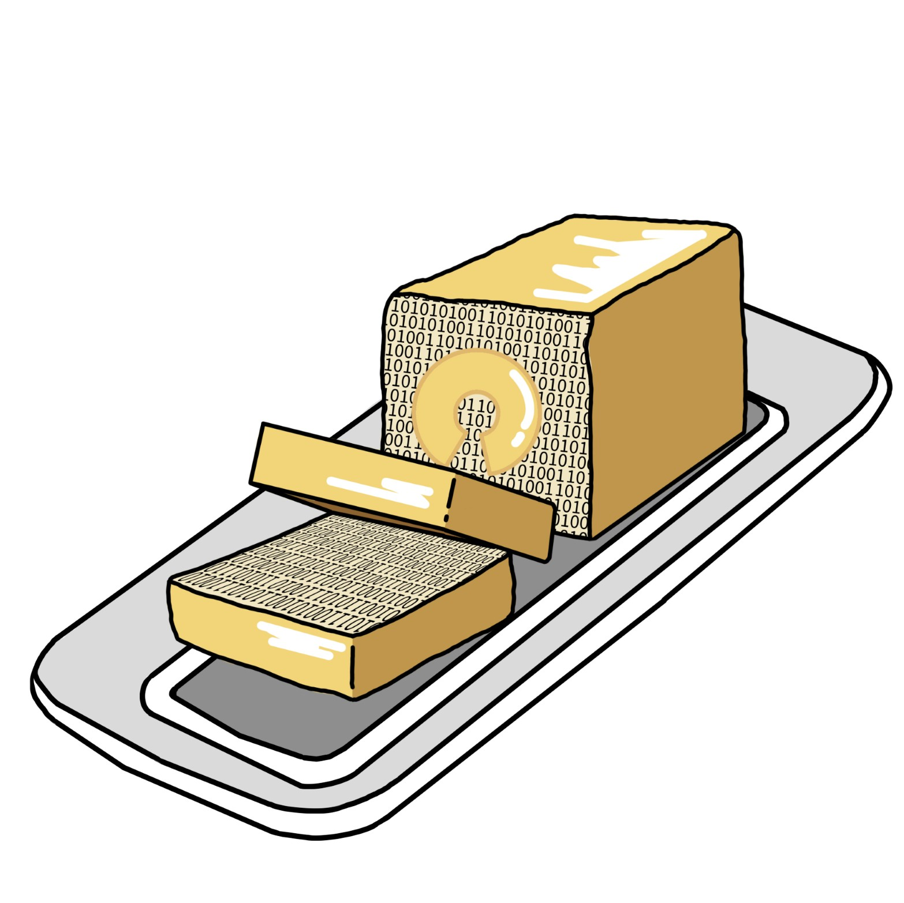

# BREAD-Local-Software (Butter)
## v1 (WIP)

## Installation And Use:
1. Load files from the [`src/webpage`](src\webpage) folder onto the SD card and mount the card on the ESP32
2. Upload the code in the .ino file under [`src/loafControl`](src\loafControl) folder to the ESP32
4. Once uploaded, connect to the newly created Wi-Fi access point "BREAD-DARPA" with the password "12345678"
5. Open the Arduino IDE serial monitor and copy the IP address
6. Paste the IP address into a web browser like Google Chrome

# In-Progress
1. Modularization of code and separation of code across multiple files
2. CSS styling 

## TODO
1. Use JSON objects to send and receive data to and from the ESP32